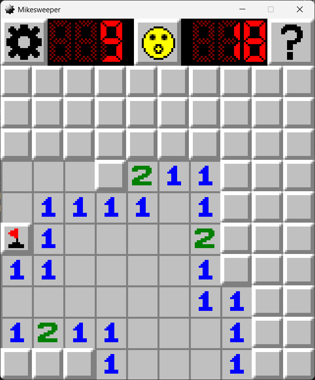

# Mikesweeper

Mikesweeper is a minesweeping simulation implemented with MonoGame. The objective of the simulation is to discover all cells while also avoiding bombs. The discovered cells provide hints as to how many bombs are nearby to help the user to avoid bombs.

## Features

### Discovering

Cells may be discovered to reveal nearby bombs. If a bomb cell is discovered, the simulation ends in a loss.
The first cell to be discovered is guaranteed to not be a bomb cell. The minefield is generated after the first cell is discovered.

### Chording

Chording allows a user to discover multiple adjacent cells that have not been flagged.
To use chording, the user must press the chord button on a discovered cell that has a number that matches the number of adjacent flags around the cell. In doing so, the user will discover all adjacent cells that are not flagged.

### Win/Loss Scenarios

The simulation may be won or lost. It is won once the user discovers all cells that do not contain a bomb.
The user loses the simulation if a bomb cell is discovered. The win status can be checked by looking at the face on the top.
If the face is smiling, the simulation is not yet over. If the face has sunglasses, the simulation has been won. If the face has crossed eyes, the simulation has been lost.

### Settings Menu

The settings menu provides options for modifying the difficulty, minefield, graphics, and modes.
Additionally, the settings are saved to the user's system, allowing them to restart the simulation with the same previous settings.

### Information Menu

The information menu provides additional details about the software and instructions for how to use the simulation.

### Puppy Mode! 🐶

The visuals may be changed for a more puppy appeal for those who feel stressed by bombs in a minefield.
This mode provides a more relaxed simulation by planting bones around instead of bombs.
